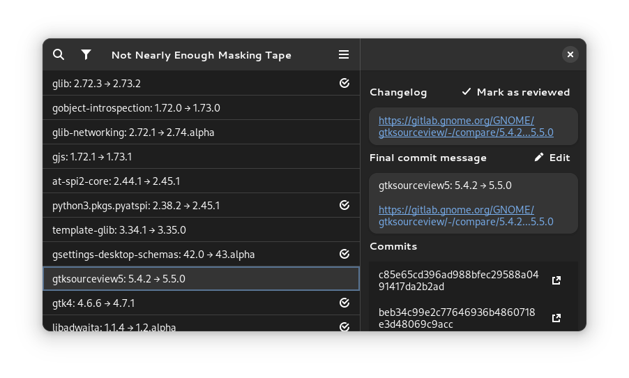

# Not Nearly Enough Masking Tape

This is a tool for reviewing large Nixpkgs pull requests such as GNOME updates. All review information are tracked in commit messages.

## How to use?

If you use [Nix flakes](https://nixos.wiki/wiki/Flakes), you can just run `nix run github:jtojnar/nonemast` in your local Nixpkgs checkout.

With stable Nix, you will need to use `nix-shell -I 'nonemast=https://github.com/jtojnar/nonemast/archive/main.tar.gz' -p '((import <nonemast>).packages.${builtins.currentSystem}.nonemast)' --run nonemast` instead.

## Why is this needed?

Nixpkgs GNOME maintainers have the following workflow: When an alpha of a new GNOME release is published, they use `update.nix` script to automatically bump all GNOME packages in Nixpkgs on the `gnome` branch. After that, they walk through the commits, reading the release notes and modifying the package expressions as necessary. To have clean Git history where each commit points to a non-broken tree, maintainers push fixup/squash commits. Those are then periodically integrated by [rebasing with auto-squashing](https://git-scm.com/docs/git-rebase#Documentation/git-rebase.txt---autosquash).

To keep track of which updates were already reviewed without modifying commits under other maintainers’ feet, the branch is append only most of the time. The review is acknowledged by creating an empty squash commit with `git commit --squash «commit-id» --allow-empty -m "Changelog-Reviewed-By: $USER"`.

But that would make it easy to miss some review commit far from the original commit in the Git log. The Git’s [notes feature](https://git-scm.com/docs/git-notes) offers a similar annotation feature but it is even more obscure than rebase, harder to use with multiple users due to the need to deal with merges, and rebasing disconnects the notes from commits.

This tool allows maintainers to preview Git log as if it was auto-squashed and additionally highlights the reviewed commits visually.

## License

The code is licensed under [MIT](LICENSE.md).
